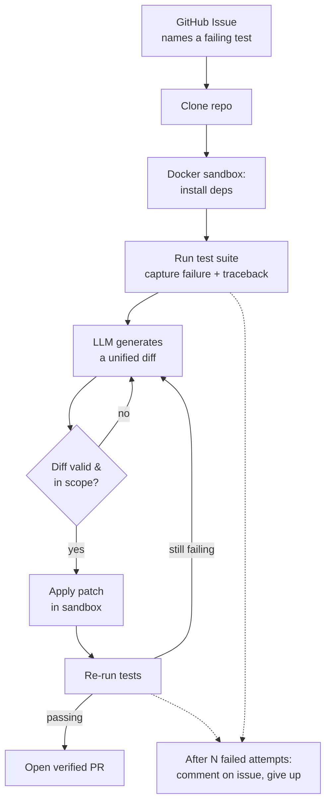

# bugfixer

An automated bug-fixing pipeline that reproduces failing tests, generates a patch using an LLM, verifies the fix inside an isolated sandbox, and opens a pull request — only if the fix is proven to work.

**Core idea:** the value here isn't "an LLM guessed a fix." It's that every fix is verified by actually re-running the test suite in isolation before anything is proposed to a human. Nothing gets opened as a PR unless it mechanically passed.

## How it works



## Why it's built this way

| Design choice | Reason |
|---|---|
| Docker sandbox for everything untrusted | Never run an arbitrary repo's install scripts or an LLM's generated code on the host machine |
| Structured JSON test output (not parsed terminal text) | Terminal output is for humans and is brittle to parse; JSON is a stable contract |
| Unified diffs, not full file rewrites | Smaller blast radius, mechanically checkable with `git apply --check` before touching anything, easier to review |
| Scope validation before applying | Rejects any diff that touches files it wasn't shown — a cheap tripwire against a wandering edit |
| Re-run tests after every patch attempt | This is what makes a PR *proven*, not just plausible |
| Retry loop with failure feedback | First-attempt success rate on non-trivial bugs is low; feeding the new failure back into the next prompt meaningfully improves results |
| Never fail silently | If the pipeline can't fix an issue, it comments explaining what it tried, rather than going quiet |

## Requirements

- Python 3.11+ (3.14 has been tested; some newer packages may lag behind on brand-new Python versions)
- Docker Desktop (or Docker Engine), running
- A Gemini API key ([aistudio.google.com/apikey](https://aistudio.google.com/apikey), free tier available) — or an Anthropic API key, see `llm_client.py`
- A GitHub Personal Access Token with repo + pull-request permissions ([github.com/settings/tokens](https://github.com/settings/tokens)) — only needed for the GitHub-integrated flow

## Setup

```bash
pip install -r requirements.txt
```

## Usage

### 1. Local sandbox + test runner only (no LLM, no GitHub)

Proves the Docker sandbox and pytest pipeline work, using the seeded-bug example repo.

```bash
python try_it.py
```

### 2. Full local fix loop (LLM, no GitHub)

Reproduces the bug in `examples/buggy_calc`, generates a patch, applies it, and verifies it — entirely locally.

```bash
./setup_example.sh          # one-time: git-init the example repo
export GEMINI_API_KEY=your_key_here
python try_orchestrator.py
```

### 3. Full pipeline: GitHub issue → verified PR

```bash
export GITHUB_TOKEN=your_token_here
export GEMINI_API_KEY=your_key_here
python try_github.py --owner your-username --repo your-repo --issue 1
```

For this to work, the target repo needs:
- A `setup.py` (or equivalent) so `pip install -e .` works
- A pytest-based test suite
- An open issue whose body contains a line exactly like:
  ```
  Failing test: tests/test_calc.py::test_add_negative_numbers
  ```

If a fix is found and verified, a branch is pushed and a PR is opened referencing the issue. If not, a comment is posted on the issue explaining what was tried.

## Project structure

```
bugfixer/
├── docker/
│   └── Dockerfile.sandbox     # isolated environment: Python, pytest, git, non-root user
├── bugfixer/
│   ├── sandbox.py             # Docker container lifecycle (start, exec, network toggle, teardown)
│   ├── test_runner.py         # runs pytest inside the sandbox, parses structured JSON results
│   ├── llm_client.py          # provider-agnostic LLM interface (Gemini / Anthropic / mock)
│   ├── patch_generator.py     # builds the prompt, parses the returned diff
│   ├── patch_applier.py       # validates + applies diffs inside the sandbox
│   ├── github_client.py       # reads issues, pushes branches, opens PRs, comments
│   └── orchestrator.py        # the retry loop tying everything together
├── examples/
│   └── buggy_calc/            # tiny repo with a seeded bug, for local testing
├── try_it.py                  # milestone 1: sandbox + test runner only
├── try_orchestrator.py        # milestone 3-4: full local fix loop
├── try_github.py              # full pipeline: GitHub issue -> verified PR
└── requirements.txt
```

## Current scope (v1) — and known limitations

This project deliberately starts narrow. These aren't oversights — they're the boundary of what v1 set out to prove:

- **Requires a known failing test.** The pipeline doesn't (yet) parse free-form natural-language bug reports — an issue must name a specific test to reproduce. This keeps "did it actually fix the bug?" a mechanically verifiable yes/no question rather than a judgment call.
- **One language, one framework.** Python + pytest only, for now.
- **One failure at a time.** If a repo has multiple failing tests, only the first is addressed per run.
- **Sandboxing is isolation, not a hardened security boundary.** Running in Docker keeps things off your host machine, but this hasn't been reviewed against a genuinely adversarial patch. Treat it as "safe for testing on repos you trust," not "safe to point at arbitrary hostile code."

## Roadmap

- [ ] Natural-language bug report parsing (issue text → failing test, without requiring an explicit reference)
- [ ] Multi-language support beyond Python/pytest
- [ ] Handle repos with multiple simultaneous failures
- [ ] Stronger sandbox hardening review
